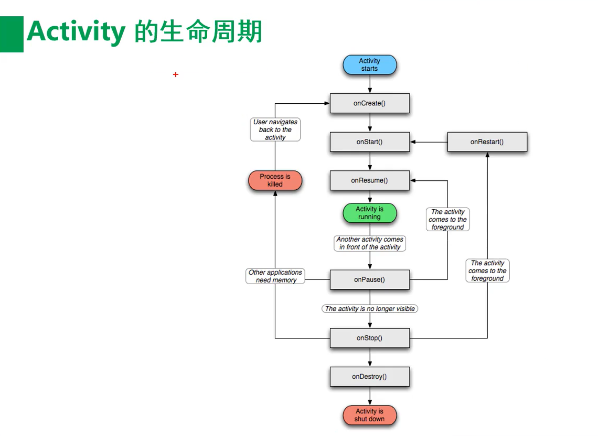
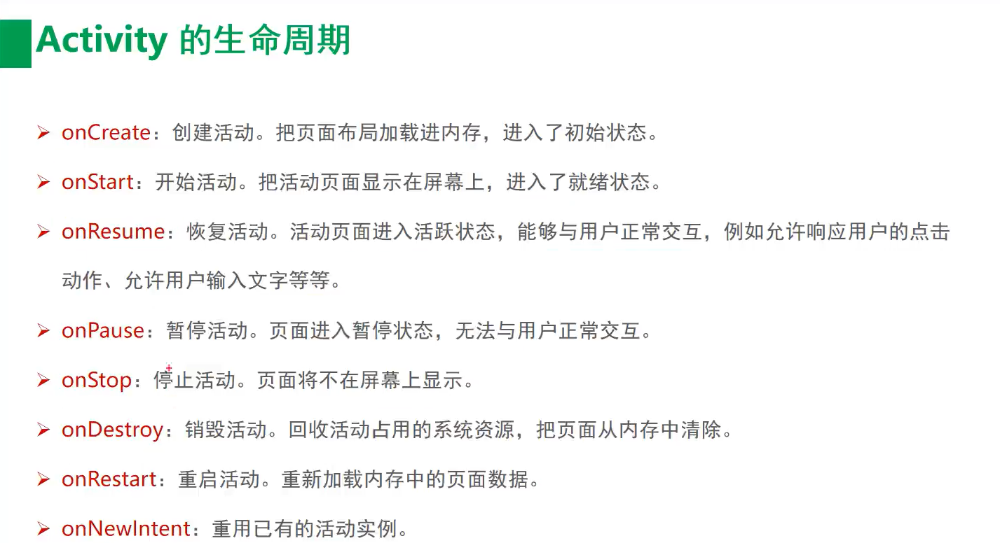
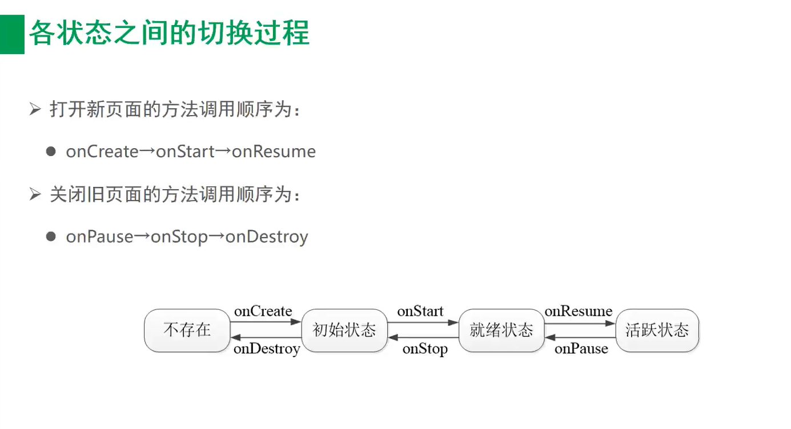

###
1. 基于linux kernel
2. OS
3.
    | 版本号|API | 发布时间|
    | :-:| :-:| :-:|
    | andriod 13| 33 | 2022-02 |
    | andriod 12| 31 | 2021-10 |
    | andriod 11| 30 | 2020-09 |
    | andriod 10| 29 | 2019-08 |
    | andriod 9| 28 | 2018-08 |
    | andriod 8| 26/27 | 2017-08 |
    | andriod 7| 24/25 | 2016-08 |
    | andriod 6| 23 | 2015-09 |
    | andriod 5| 21/22 | 2014-06 |
    | andriod 4.4| 19/20 | 2013-09 |
4. 日志等级
    - Log.e(error)  错误
    - Log.w(warn)   警告
    - Log.i(info)   一般
    - Log.d(debug)  调试
    - Log.v(verbose)  冗余
5. 开发模式
    - 原生开发
        - java kotlin
        - c c++
        - xml jetpack compose
        - SQLite
    - 混合开发
        - uni-app
        - Flutter
        - React Native
    - SQLite 是app端内嵌的一段关系型数据库程序
6. 项目目录结构
    1. app(代表模块)
        - mainfests 只有一个AndroidManifest.xml文件 是模块运行的清单文件 配置
        - java 源代码包
        - res 资源文件包 包括布局 图片
            - drawable 图片文件
            - layout 布局
            - mipmap 启动图标
            - values 常量参数
    2. scripts(代表构建)
        - build.gradle 项目配置文件和模块配置文件 编译规则
        - setting.gradle 项目编译时需要加载的全局配置和加载的子模块
        - proguard-rules.pro 源代码混淆规则 保护源代码文件防止反编译
        - gradle.properties 编译工程时的参数(一般不需要改动)
        - local.properties 搭建项目时的一些参数一般配置本地的sdk ndk目录 不要手动修改也不需要git托管
7. 图像尺寸 字体大小
    | 单位| 描述 | 说明|
    | :-:| :-:述 | :-:|
    | px | 像素  |单个像素的大小并不固定 会根据屏幕大小像素格式改变 |
    | resolution | 分辨率 | 屏幕垂直和水平方向上的像素个数 1920*1080 垂直方向1920个像素点 水平方向上1080个像素点|
    | dpi | 像素密度 | 屏幕每英寸像素个数 1英寸=2.51cm|
    | density | 密度 | 屏幕每平方英寸像素个数 1英寸=2.51cm|
    | dip/dp | 设备独立像素 | 长度单位 与设备的密度有关|
    计算实列 4.95英寸 1920*1080
    - dpi = sqrt(1920^2 * 1080^2) / 4.95 = 445
    - px = dpi * dip / 160 = 445 / 160 = 2.78px
8. 颜色
    - 使用16进制表示 8位或者6位
    - 透明度 + RGB色值  #FF00FF0000
    - xml默认透明度FF(完全不透明)  代码中设置默认透明度00(完全透明)
## 生命周期
1. onCreate
2. onStart
3. onResume
4. onPause
5. onStop
6. onDestroy
7. onRestart
8. onNewIntent
9. 
10. 
11. 
## 启动模式
1. 静态设置 AndroidManifest.xml注册activity时可以设置 android:launchMode
    - standard  标准入栈出栈流程
    - singleTop  如果栈顶有目标活动就复用不会再创建
    - singleTask 如果栈内有目标活动就复用 并出栈直至目标活动处于栈顶
    - singleInstance 单独为改活动创建一个栈
2. 动态配置 代码中使用意图Intent.setFlags方法设置
    - FLAG_ACTIVITY_NEW_TASK    类似standard  如果不存在就会创建一个新的
    - FLAG_ACTIVITY_SINGLE_TOP    等同singleTop
    - FLAG_ACTIVITY_CLEAR_TOP    类似singleTask 如果有就清空其上方所有活动再新建一个
    - FLAG_ACTIVITY_NO_HISTORY    类似standard 栈顶不保存创建的活动 每次都是全新的standard流程
    - FLAG_ACTIVITY_CLEAR_TASK   清空栈内所有活动再新建  需要配合 FLAG_ACTIVITY_NEW_TASK一起使用
## 意图
1. 显示意图    通过设置componentName直接指明的跳转的意向和动作
    - Intent 构造类中指定来源和去向
    - Intent.setClass 设置来源和去向
    - Intent.setComponent 设置来源和去向
2. 隐式意图    通过设置action data category 过滤意向由系统来判断跳转动作 属于模糊匹配
    - ACTION_MAIN       android.intent.action.MAIN      系统入口文件
    - ACTION_VIEW       android.intent.action.VIEW      向用户显示数据
    - ACTION_SEND       android.intent.action.SEND      发送内容
    - ACTION_SENDTO       android.intent.action.SENDTO      跳转发送短信界面
    - ACTION_CALL       android.intent.action.CALL      直接拨号
    - ACTION_DIAL       android.intent.action.DIAL      跳转拨号界面
    - ACTION_ANSWER       android.intent.action.ANSWER      接听电话
## 图形
1. drawable 图片 面板 图标 背景图
    - 所有的图形都是Drawable类的子类 一般drawable目录下存放图形的描述文件.xml 具体的图形会放在对应的目录下
    - -ldpi 低分辨率 240*320
    - -mdpi 中等分辨率 320*480
    - -hdpi 高等分辨率 480*800                   一般对应4~4.5inch手机
    - -xhdpi 高等分辨率 720*1280                 一般对应5~5.5inch手机
    - -xxhdpi 高等分辨率 1080*1920               一般对应6~6.5inch手机
    - -xxxhdpi 等分辨率 1440*2560              一般对应超过7inch智能设备
2. 形状图形 圆角 椭圆 矩形 直线 圆环
## EditText
1. hint             提示文字 默认胡灰色显示
2. textColorHint    提示文字颜色
3. maxLength        输入的最大长度
4. inputType        输入类型
    - text                  文本
    - textPassword          文本密码
    - number                数字
    - numberSigned          带符号数字 允许负号
    - numberDecimal         浮点数
    - numberPassword        数字密码
    - phone                 手机号
    - datetime              日期和时间的组合 可以有-/:
    - date                  日期可以有-/
    - time                  时间可以有:
## 数据存储
1. SharedPreferences 共享参数
    - 轻量级 采用 k-v 形式存储的 xml文件
    - 文件路径 /data/data/应用包名/shared_prefs/xxx.xml
    - 简单文本且孤立数据
    - app个性化配置数据
2. SQLite
    - 遵守ACID关系型轻量级数据库
    - 整个数据库都是放置在宿主机上一个单一的文件
    - 事务的开启提交回滚都是直接锁整个文件
3. SQLiteDatabases
    - 管理SQLite的工具
    - API-DMI
        - openDatabase  打开指定文件数据库
        - isOpen    数据库是否已打开
        - close     关闭数据库
        - getVersion    获取版本号
        - setVersion    设置版本号
4. Application
    - 应用的启动时会创建唯一的一个application实列
    - application和activity的关系 类比 进程和线程的关系
    - 适合使用application存储公共变量的场景
        - 频繁读取的数据 比如 用户id 手机号
        - 意图跳转时不方便传递的数据 比如 位图 二进制文件
        - 容易因为频繁创建而分配内存的对象 比如 Handler
        - 需要整个app应用阶段都存在的数据 比如 websocket